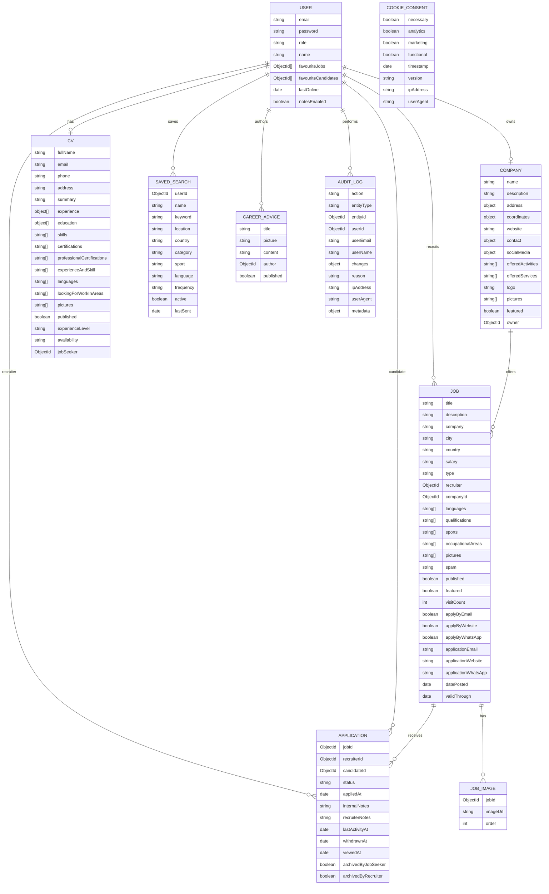

# Entity Relationship Diagram

This diagram represents the database schema and relationships for the ChickenLoop website.

```mermaid
erDiagram
    USER ||--o| COMPANY : "owns"
    USER ||--o{ JOB : "recruits"
    USER ||--o{ APPLICATION : "recruiter"
    USER ||--o{ APPLICATION : "candidate"
    USER ||--o| CV : "has"
    USER ||--o{ SAVED_SEARCH : "saves"
    USER ||--o{ CAREER_ADVICE : "authors"
    USER ||--o{ AUDIT_LOG : "performs"

    COMPANY ||--o{ JOB : "offers"

    JOB ||--o{ APPLICATION : "receives"
    JOB ||--o{ JOB_IMAGE : "has"

    USER {
        string email
        string password
        string role
        string name
        ObjectId[] favouriteJobs
        ObjectId[] favouriteCandidates
        date lastOnline
        boolean notesEnabled
    }

    COMPANY {
        string name
        string description
        object address
        object coordinates
        string website
        object contact
        object socialMedia
        string[] offeredActivities
        string[] offeredServices
        string logo
        string[] pictures
        boolean featured
        ObjectId owner
    }

    JOB {
        string title
        string description
        string company
        string city
        string country
        string salary
        string type
        ObjectId recruiter
        ObjectId companyId
        string[] languages
        string[] qualifications
        string[] sports
        string[] occupationalAreas
        string[] pictures
        string spam
        boolean published
        boolean featured
        int visitCount
        boolean applyByEmail
        boolean applyByWebsite
        boolean applyByWhatsApp
        string applicationEmail
        string applicationWebsite
        string applicationWhatsApp
        date datePosted
        date validThrough
    }

    APPLICATION {
        ObjectId jobId
        ObjectId recruiterId
        ObjectId candidateId
        string status
        date appliedAt
        string internalNotes
        string recruiterNotes
        date lastActivityAt
        date withdrawnAt
        date viewedAt
        boolean archivedByJobSeeker
        boolean archivedByRecruiter
    }

    CV {
        string fullName
        string email
        string phone
        string address
        string summary
        object[] experience
        object[] education
        string[] skills
        string[] certifications
        string[] professionalCertifications
        string[] experienceAndSkill
        string[] languages
        string[] lookingForWorkInAreas
        string[] pictures
        boolean published
        string experienceLevel
        string availability
        ObjectId jobSeeker
    }

    JOB_IMAGE {
        ObjectId jobId
        string imageUrl
        int order
    }

    SAVED_SEARCH {
        ObjectId userId
        string name
        string keyword
        string location
        string country
        string category
        string sport
        string language
        string frequency
        boolean active
        date lastSent
    }

    AUDIT_LOG {
        string action
        string entityType
        ObjectId entityId
        ObjectId userId
        string userEmail
        string userName
        object changes
        string reason
        string ipAddress
        string userAgent
        object metadata
    }

    CAREER_ADVICE {
        string title
        string picture
        string content
        ObjectId author
        boolean published
    }

    COOKIE_CONSENT {
        boolean necessary
        boolean analytics
        boolean marketing
        boolean functional
        date timestamp
        string version
        string ipAddress
        string userAgent
    }
```
