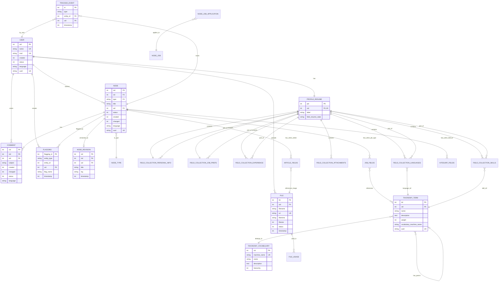
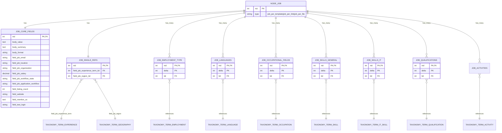
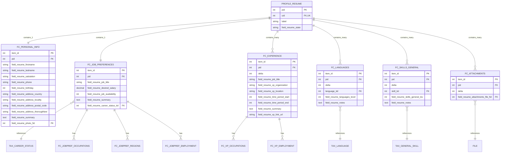
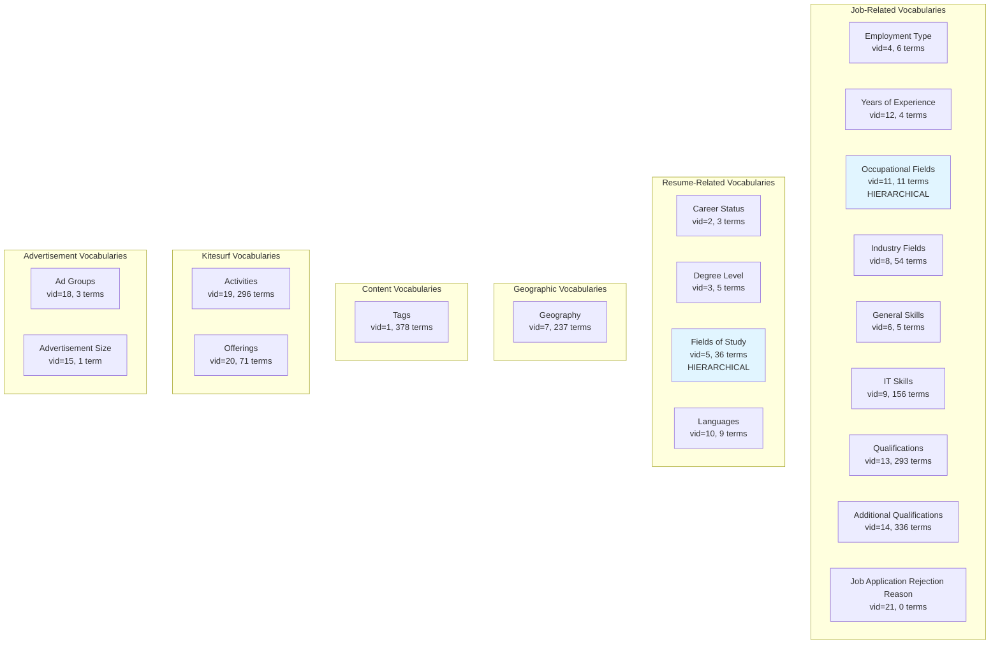
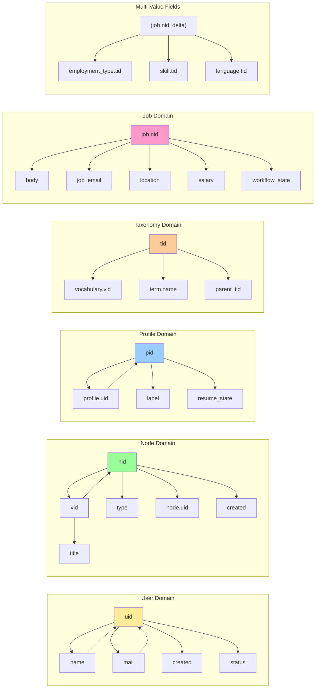
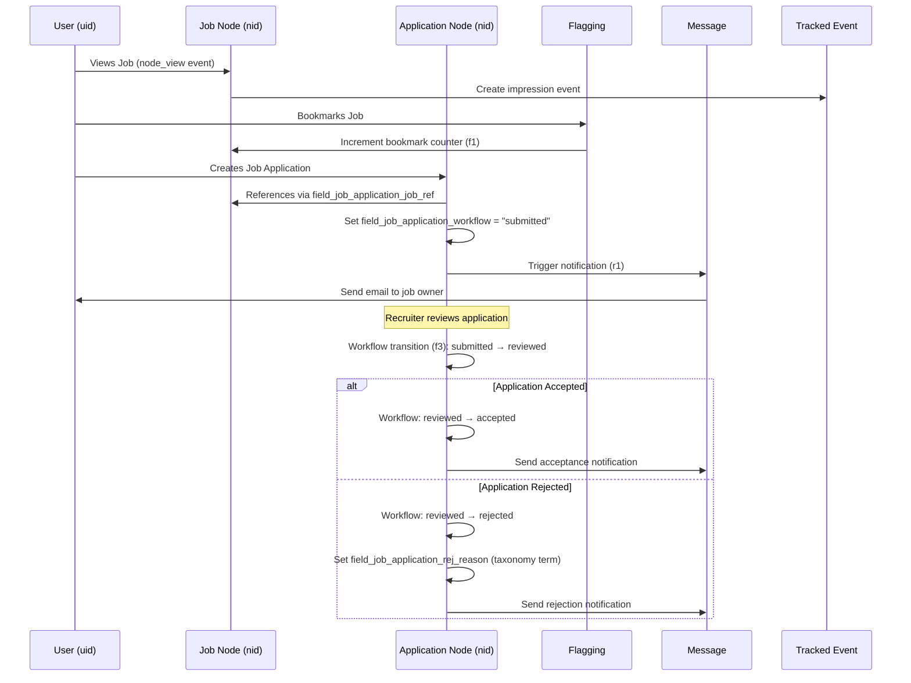
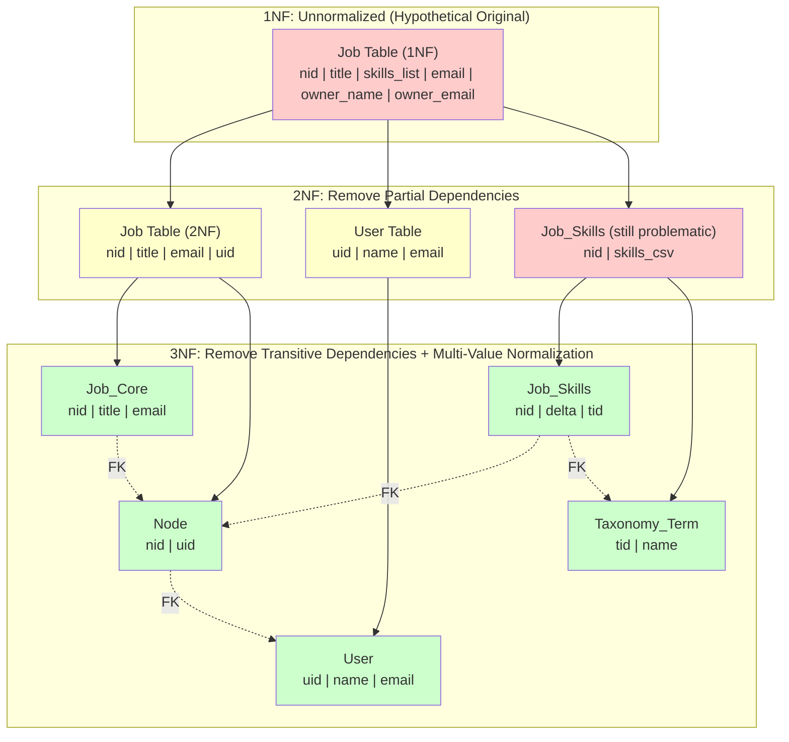
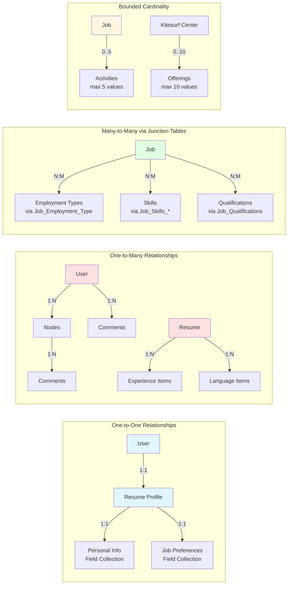
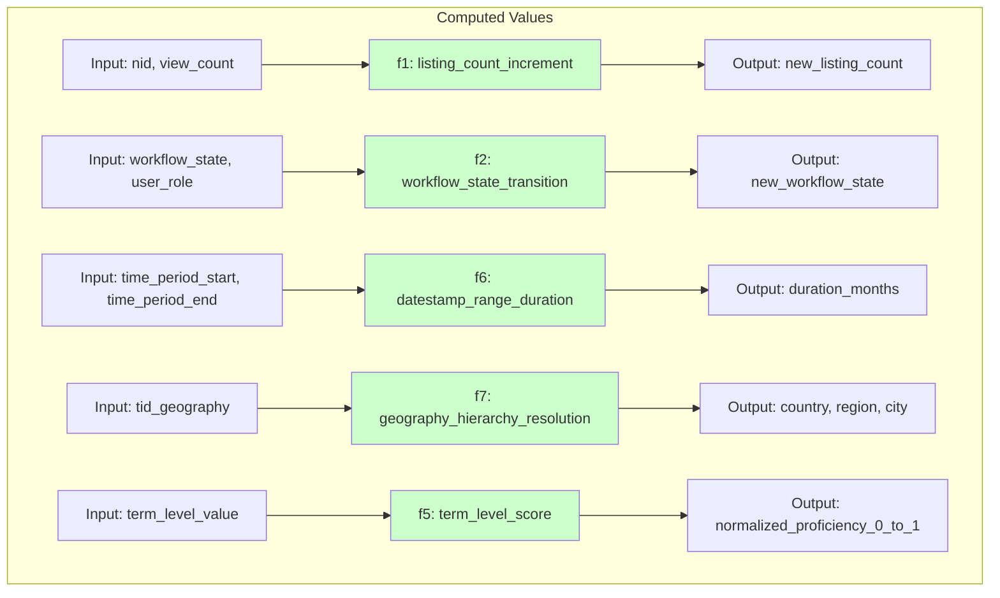
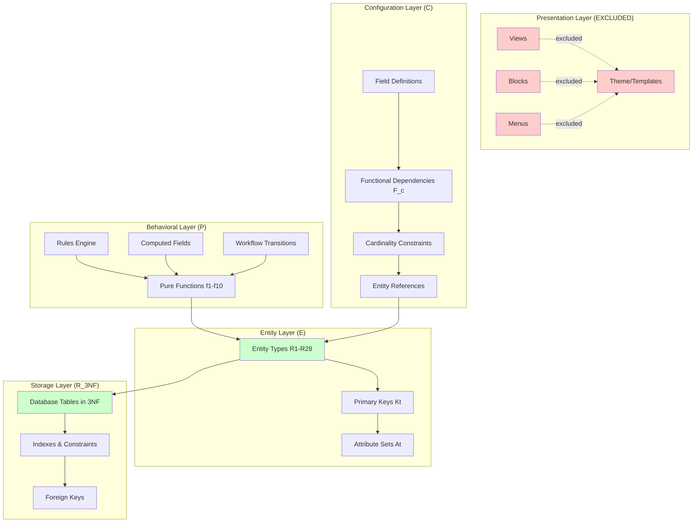

# Chickenloop.com Data Structure Diagrams

## Overview Entity Relationship Diagram

## Job Posting Data Structure

## Resume Profile Data Structure

## Taxonomy Vocabulary Structure

## Functional Dependencies Graph

## Data Flow: Job Application Process

## Normalization: 1NF → 2NF → 3NF Example

## Cardinality Constraints Visualization

## Pure Functions (Behavioral Layer)

## System Architecture Layers

---

## Legend

**Entity Relationship Notation:**
- `||--||` One-to-one relationship
- `||--o{` One-to-many relationship
- `}o--o{` Many-to-many relationship
- `}o--||` Many-to-one relationship
- `PK` Primary Key
- `FK` Foreign Key
- `UK` Unique Key

**Functional Dependency Notation:**
- `A → B` A functionally determines B
- `A -.-> B` B functionally determines A (reverse/unique constraint)

**Cardinality:**
- `1` Exactly one
- `0..1` Zero or one
- `N` or `*` Many (unlimited)
- `0..5` Up to 5 values

**Colors:**
- Green: Included in extraction (semantic data)
- Red: Excluded from extraction (presentation layer)
- Yellow: Intermediate normalization states
