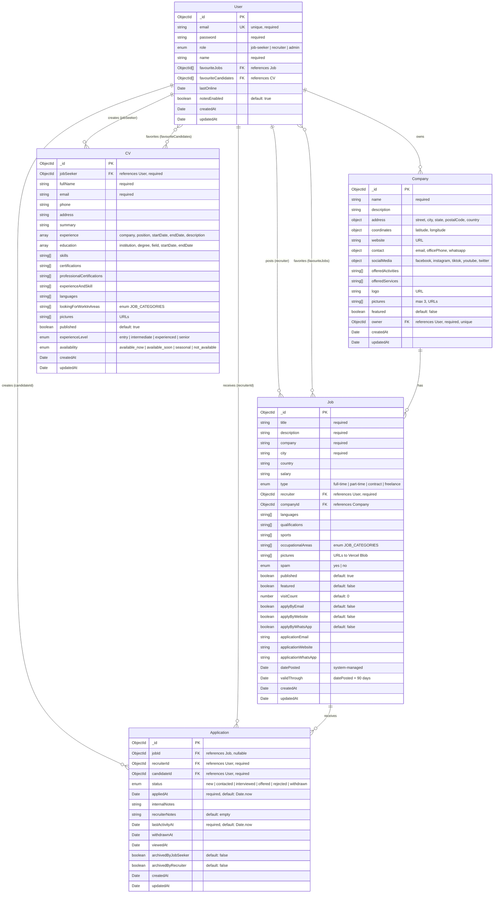

# Entity Relationship Diagram - ChickenLoop Next.js

## ER Diagram (Mermaid)



## Relationships Explained

### User Relationships
- **User → Job (as recruiter)**: One-to-Many
  - A recruiter user can post multiple jobs
  - Field: `Job.recruiter` references `User._id`

- **User → Company (as owner)**: One-to-Many
  - A user can own one company (unique constraint)
  - Field: `Company.owner` references `User._id` (unique)

- **User → CV (as jobSeeker)**: One-to-Many
  - A job-seeker user can create multiple CVs
  - Field: `CV.jobSeeker` references `User._id`

- **User → Application (as candidate)**: One-to-Many
  - A user can submit multiple applications
  - Field: `Application.candidateId` references `User._id`

- **User → Application (as recruiter)**: One-to-Many
  - A recruiter can receive multiple applications
  - Field: `Application.recruiterId` references `User._id`

- **User ↔ Job (favorites)**: Many-to-Many
  - Users can favorite multiple jobs
  - Field: `User.favouriteJobs` is an array of `Job._id`

- **User ↔ CV (favorites)**: Many-to-Many
  - Recruiters can favorite multiple candidates (CVs)
  - Field: `User.favouriteCandidates` is an array of `CV._id`

### Company Relationships
- **Company → Job**: One-to-Many
  - A company can have multiple job postings
  - Field: `Job.companyId` references `Company._id`

### Job Relationships
- **Job → Application**: One-to-Many
  - A job can receive multiple applications
  - Field: `Application.jobId` references `Job._id`
  - Note: jobId can be null (direct contact without job posting)

## Key Design Patterns

### 1. **Embedded Arrays for Many-to-Many**
- Favorites are stored as arrays of ObjectIds in the User document
- This denormalization improves read performance for user profiles

### 2. **File Storage**
- All files (images, CVs, attachments) are stored in Vercel Blob
- Only URLs are stored in MongoDB
- Job images are preprocessed (resized to 800px, compressed to <100KB)

### 3. **Soft Relationships**
- Job can have both `company` (string) and `companyId` (ObjectId)
- This allows jobs without a formal Company entity
- Useful for migrated data where company entities don't exist

### 4. **Application Types**
- Applications can be job-specific (`jobId` set) or direct recruiter contacts (`jobId` is null)
- Unique constraint on `recruiterId + candidateId` prevents duplicate contacts
- Unique constraint on `jobId + candidateId` prevents duplicate job applications (sparse index)

### 5. **Status Tracking**
- Applications have comprehensive status enum for workflow management
- Jobs have spam detection enum (yes/no)
- Jobs have published flag for draft/live state
- CVs have published flag for visibility control

### 6. **Application Methods**
- Jobs support three application methods: Email, Website, WhatsApp
- Each method has a boolean flag and associated contact field
- Allows flexible application workflows

### 7. **Metadata & Activity Tracking**
- All entities have `createdAt` and `updatedAt` timestamps
- Jobs track `visitCount` for analytics
- Jobs have system-managed `datePosted` and `validThrough` for Google Jobs SEO
- Users track `lastOnline` for activity monitoring
- Applications track `lastActivityAt`, `viewedAt`, `withdrawnAt`

### 8. **Archiving System**
- Applications can be archived by both job-seekers and recruiters independently
- Allows soft deletion without losing data

## Indexes (Implemented)

```javascript
// User
User.index({ email: 1 }, { unique: true })
User.index({ role: 1 })
User.index({ createdAt: -1 })
User.index({ lastOnline: -1 })

// Job
Job.index({ createdAt: -1 })
Job.index({ updatedAt: -1 })
Job.index({ published: 1, createdAt: -1 })
Job.index({ featured: 1, published: 1 })
Job.index({ recruiter: 1 })
Job.index({ companyId: 1 })
Job.index({ country: 1 })
Job.index({ city: 1 })
Job.index({ type: 1 })

// Company
Company.index({ owner: 1 }, { unique: true })
Company.index({ featured: 1 })
Company.index({ createdAt: -1 })

// CV
CV.index({ createdAt: -1 })
CV.index({ published: 1, createdAt: -1 })
CV.index({ jobSeeker: 1 })
CV.index({ experienceLevel: 1 })
CV.index({ availability: 1 })

// Application
Application.index({ jobId: 1, candidateId: 1 }, { unique: true, sparse: true })
Application.index({ recruiterId: 1, candidateId: 1 }, { unique: true })
Application.index({ recruiterId: 1, status: 1 })
Application.index({ candidateId: 1 })
Application.index({ jobId: 1 }, { sparse: true })
Application.index({ status: 1, appliedAt: -1 })
Application.index({ lastActivityAt: -1 })
```

## Data Statistics (Current)

- **Users**: 4,507 (mostly job-seekers from Drupal migration)
- **Jobs**: 30 (newest jobs migrated, with images)
- **Companies**: 84 (auto-created for recruiters)
- **CVs**: 151
- **Applications**: 28
- **Job Images**: 53 images across all 30 jobs (avg 1.77 per job)

## Migration Notes

- Migrated from Drupal 7 (300+ tables) to this simplified 5-entity model
- 97% reduction in database complexity
- All users migrated with preserved creation dates
- Latest 30 jobs migrated with full field data and images
- Images downloaded from Drupal, resized, compressed, and uploaded to Vercel Blob
